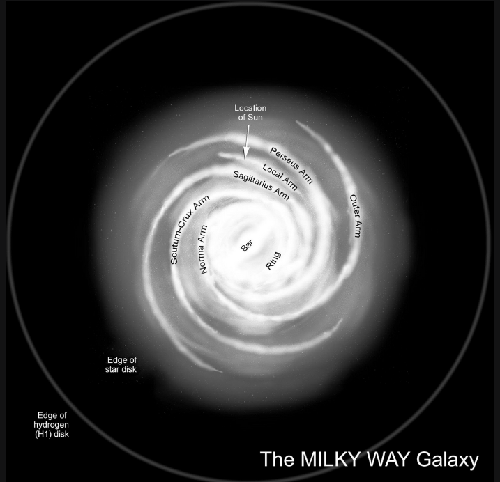

# Cosmic Hierarchy

### The Universe (Cosmos)
- Ultimate container of reality
- Maybe Many

### The Observable Universe
- Total region that humans can/have seen from Earth (theoretically)
- 93 billion light years in diameter

### Superclusters (The Laniakea Supercluster)
- Contains approx. 100,000 galaxies

### The Local Group
- Cluster of approx. 50 galaxies
- Milky Way, the Andromeda, the Triangulum

### The Milky Way (Galaxy)
- 100 to 400 billion stars like the Sun make up the galaxy
- Collections of gas, dust, stars held together by gravity
- **Type:** Barred Spiral
- We are located on one of its outer arms
- Sun nestled between Orion-Cygnus arm (minor spiral arm)

### The Solar System
- Sun + Eight planets + their moons + asteroids and comets
- **Inner Rocky planets:** Mercury, Venus, Earth, Mars
- **Outer gas giants:** Jupiter, Saturn, Uranus, Neptune

### The Earth (World)
- Continents + Oceans + Atmosphere